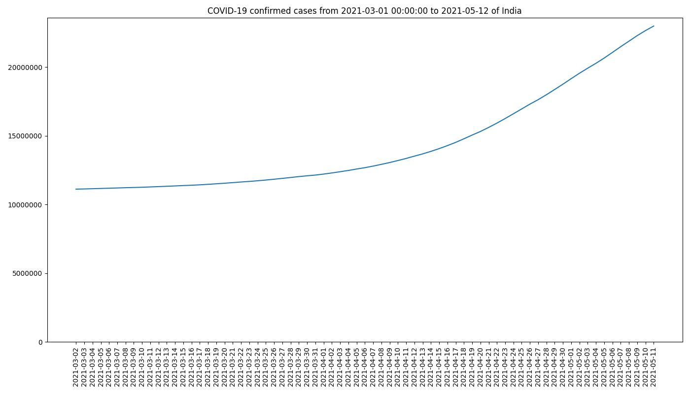

# Automatic ETL running with Airflow

## Prerequisites
* Install Docker
* Install Docker Compose

## Usage:
* run airflow with docker:
    * docker command: docker-compose up (running this command will pull postgres and airflow images from docker hub, and run the services)

    * Airflow will be running on http://localhost:8080/

* in the dag folder:
    * covid_etl.py is the script which execute the ETL.
    * function covid_etl with given arguments "country", "starting_day" will download all COVID statics of this country from the starting_day, then clean the data (check for NULL values, empty returns and the uniqueness of primary keys), at last it will load the selected data into database.
    * function sql2figure will make a plot of "confirmed cases" of selected country from the starting day.

## Example:
* In the figure folder, image reports of confirmed COVID cases of selected country will be automatically generated every day.

